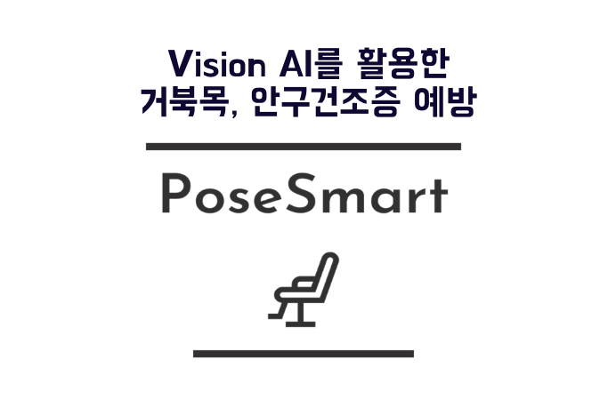
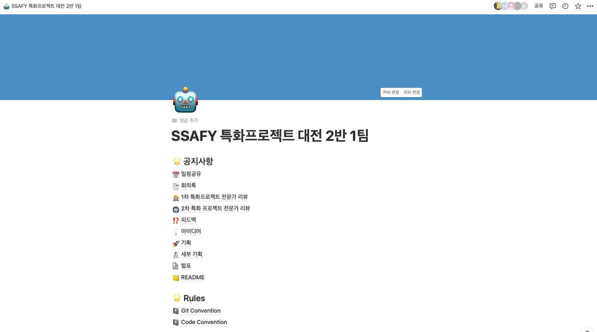
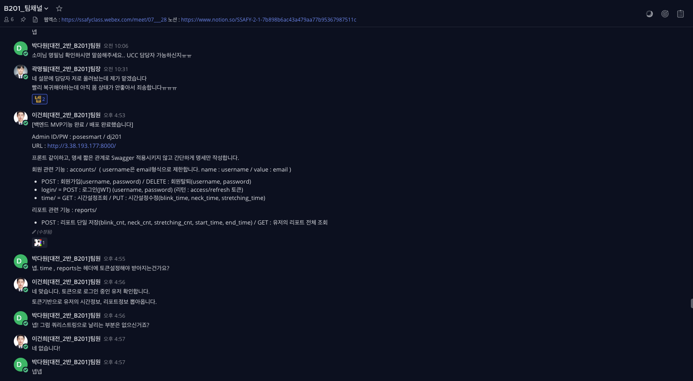

# README



### 포즈 스마트는 Vision AI를 통해,

### 거북목 증후군과 안구 건조증에 도움을 줄 수 있는 서비스입니다.

# ✨기획 배경

- 점점 늘어가는 거북목 증후군 환자와 안구 건조증 환자
- 코로나와 현대 사회의 컴퓨터 이용량 증가
- 웹 캠의 보유 현황 증가

# 🎈기획 의도

- 거북목 자세와 눈 깜빡임은 본인이 인지하기 힘들기 때문에 웹 캠을 사용하여 알림을 울려 이용자들의 건강에 도움을 줄 수 있도록 함

# 💭요구사항 정의서


# 💻프로젝트 기간 - [2022.02.21 ~ 2022.04.08]

# 🎇주요 기능

- 거북목 감지
- 눈 깜빡임 감지
- FaceID (신원 확인)

# 🖥️개발환경

### 🖱Front-end

- Vue Cli (2.0)
- Typescript
- Vuetify
- Axios

### 🖱Back-end

- Python, Django DRF, Mysql, Django ORM
- Pytest
- AWS(EC2), Nginx, Gunicorn
- Git / Docker Hub / Jenkins / Docker

# 💫서비스 아키텍처


---

## 📌주요 개발

### 🖱Front-end

- Axios를 이용한 비동기 처리
- setInterval을 통해 반복적인 통신 처리
- 사용자 미디어 장치 접근을 통한 이미지 캡처

### 🖱Back-end

- Python을 활용한 AI 모델 서버 연동
- Django DRF, Django ORM, Mysql를 이용한 서버 Application 개발
- Pytest를 활용한 테스트 코드 구현 및 AI 응답시간 측정
- AWS(EC2), Nginx, Gunicorn을 활용한 배포
- Git / Docker Hub / Jenkins / Docker를 활용한 CI/CD

# ✨코드 컨벤션

```jsx
**Code Convention Rule**
    - 어려운 복잡한 단어나 헷갈리는 스펠링(10자이상) 은 우리끼리의 심볼 사용
    - 심볼된 거는 카멜 표기법 대신 파스칼 표기법
        
        ex)  **psychological test → PCLtest**
        
         **mind test → mindTest**
```

# ✨Git 컨벤션

```jsx
feat : 새로운 기능에 대한 커밋
modify : 기존 기능 수정에 대한 커밋
fix : 버그 수정에 대한 커밋 
build : 빌드 관련 파일 수정에 대한 커밋 
chore : 코드 의미에 영향을 주지 않는 변경사항 (포맷, 세미콜론 누락, 공백 등)
ci : CI 관련 설정 수정에 대한 커밋 
docs : 문서 수정에 대한 커밋 
style : 코드 스타일 혹은 포맷 등에 관한 커밋
design : 화면 디자인에 관한 커밋
refactor : 코드 리팩토링에 대한 커밋 
test : 테스트 코드에 대한 커밋

ex ) 
**feat: 관심지역 알림 ON/OFF 기능 추가** 

시군구의 알림을 각각 ON/OFF 할 수 있도록 기능을 추가함 

출처: https://xtring-dev.tistory.com/entry/Git-규칙적인-Commit-메세지로-개발팀-협업하기-👾 [xtr
```

# 💡Git 브랜치 전략

```jsx
- **브랜치 전략**
    - GIT Branch
    - 브랜치 명 : **feature/역할(frontend/backend)/기능**
```

# 👨‍👦‍👦팀 구성

**곽명필(팀장, FE)**

**김두회(BE)**

**박다원(FE)**

**박소미(AI)**

**이건희(BE)**

**한상우(AI)**

# 👨‍👩‍👧 협업 툴

- Gitlab
    
    
    
- Jira
    
    
    
    지라를 통해 일정및 업무 관리와 협업을 진행했습니다. 스프린트는 일주일 단위로 진행하며, 일주일의 시작인 월요일에 그 주에 진행되어야 할 범위를 정하고 계획을 정했습니다.
    
- Notion
    
    
    
- Mattermost
    
    
    
- Webex
    
    
    

# 👨‍👩‍👧 Scrum

매일 아침 10시에 팀 단위로 할 일을 20분 정도 공유하고 각자 팀으로 가서 지라에 이슈를 등록했습니다. 유연한 분위기에서 스크럼을 통해서 개발에 집중할 수 있는 팀 분위기를 만들었습니다.
